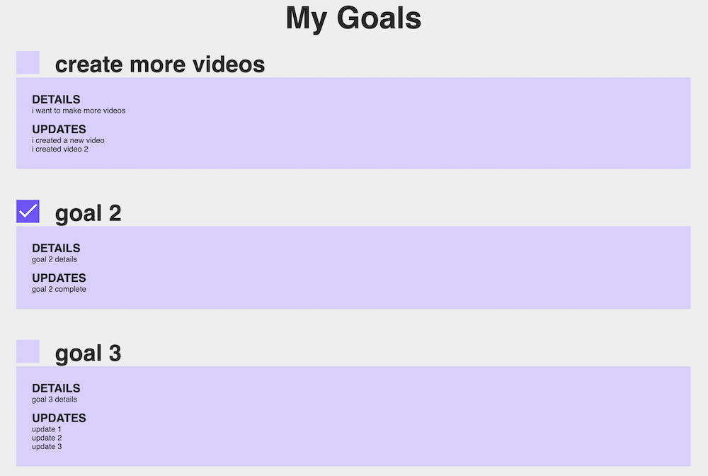

# HOW TO DISPLAY AIRTABLE DATA IN A REACT PROJECT TUTORIAL

## SEE PROJECT HERE 
https://juzdepom.github.io/react-airtable-goals-tutorial/
## PROJECT SCREENSHOT

### STEPS 
- create the airtable base
- create the react project
- install the packages
- import the airtable data
- write code for displaying data
- write formatting code

## ORIGINAL GITHUB PROJECT
https://github.com/codeSTACKr/goal-manager-react
## YOUTUBE TUTORIAL
https://youtu.be/FEoEvSmtmPQ

3:00 creating the database in airtable

5:00 linking tables in airtable

7:30 create project

7:50 installing packages airtable styled-components

8:41 getting api key and base id

10:30 start coding

14:00 writing code for displaying data

14:30 writing code for goal component

18:00 styling

32:00 uploading to github

33:00 checking code quality with embold